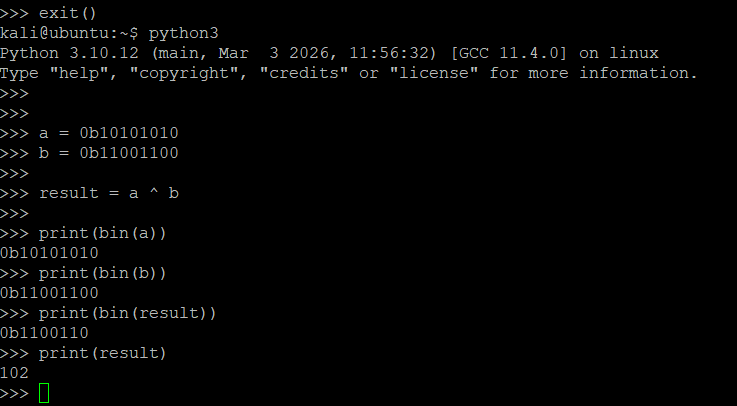
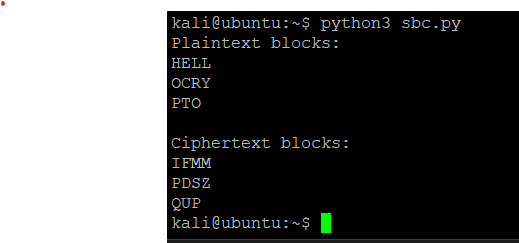
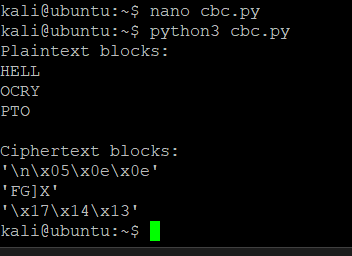
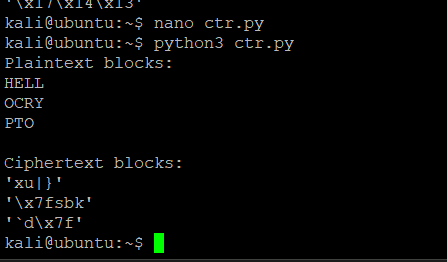
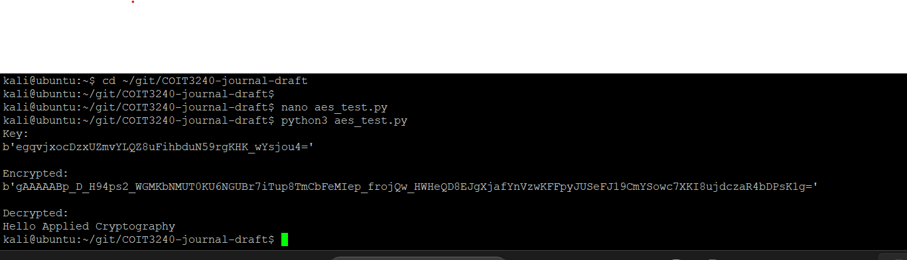

# Week 04

## Task 1 – XOR Operation

I tested the XOR operation in Python using two binary values.

- a = 10101010
- b = 11001100

The XOR result was:

- result = 01100110
- decimal = 102

XOR returns 1 when the bits are different and 0 when the bits are the same. XOR is important in cryptography because it is used in stream ciphers, one-time pads and CTR mode encryption.

---

## Task 2 – Simple Block Cipher (SBC)

I created a simple block cipher in Python. The plaintext was divided into blocks of 4 characters, and each character was shifted by +1 to simulate encryption.

Example:
- H became I
- E became F

The plaintext blocks and ciphertext blocks were displayed separately. This demonstrated how block ciphers process fixed-size blocks independently.

This type of encryption is weak because the same plaintext block always produces the same ciphertext block.

---
### SBC Table Example

Using the SBC lookup table from the tutorial:

- Plaintext = 10110
- Key = 101
- Ciphertext = 01011

Decryption example:
- Ciphertext = 11111
- Key = 011
- Plaintext = 00000

This demonstrated how encryption and decryption are performed using the SBC lookup table.
## Task 3 – CBC Mode Encryption

I created a simple CBC (Cipher Block Chaining) style encryption script in Python. In CBC mode, each plaintext block is XORed with the previous ciphertext block before encryption.

An initialization vector (IV) of "AAAA" was used for the first block.

Unlike ECB mode, repeated plaintext blocks do not produce identical ciphertext blocks because each block depends on the previous encrypted block.

This improves confidentiality and hides plaintext patterns better than simple block encryption.

---

## Task 4 – CTR Mode Encryption

I implemented a simple CTR (Counter) mode style encryption script in Python. A counter value was used to generate a keystream, and the plaintext was XORed with the keystream to produce ciphertext.

Unlike CBC mode, CTR mode does not depend on previous ciphertext blocks. Each block is encrypted independently using a different counter value.

CTR mode behaves similarly to a stream cipher and allows parallel encryption and decryption.

---

## Task 5 – Comparison of ECB, CBC and CTR Modes

I compared simple block encryption, CBC mode and CTR mode.

### ECB / Simple Block Cipher
- Each block is encrypted independently.
- Identical plaintext blocks produce identical ciphertext blocks.
- Patterns in the plaintext may remain visible.
- Weak against pattern analysis.

### CBC Mode
- Each plaintext block is XORed with the previous ciphertext block before encryption.
- Repeated plaintext blocks produce different ciphertext blocks.
- More secure than ECB because patterns are hidden.
- Encryption depends on previous blocks.

### CTR Mode
- Uses a counter to generate a keystream.
- Plaintext is XORed with the keystream.
- Blocks are independent and can be processed in parallel.
- Faster and more flexible than CBC in many situations.

From the experiments, CBC and CTR produced ciphertext that looked more random than the simple block cipher. This demonstrated why modern cryptographic systems avoid ECB mode and prefer modes like CBC or CTR.

---

## Task 6 – AES Encryption in Python

I used the Python cryptography library to encrypt and decrypt a message using AES-based Fernet encryption.

The program generated a random encryption key, encrypted the plaintext message, and then successfully decrypted it back to the original message.

This demonstrated symmetric encryption because the same key was used for both encryption and decryption.

The ciphertext output appeared random and unreadable without the key.

---

## Reflection

This week helped me understand how block ciphers operate in different modes. XOR operations are simple but extremely important in cryptography because they are used in stream ciphers, CBC mode and CTR mode.

The experiments showed that simple block encryption (similar to ECB) is weak because repeated plaintext patterns remain visible. CBC mode improved security by chaining ciphertext blocks together, while CTR mode used a counter-based keystream and behaved more like a stream cipher.

The AES encryption task using Python demonstrated real-world symmetric encryption. The ciphertext output appeared random and unreadable, while the same key was required for successful decryption.

From these activities, I learned why modern systems avoid ECB mode and instead use stronger modes such as CBC, CTR and GCM.
CBC mode improves confidentiality by chaining blocks together, while CTR mode improves efficiency because blocks can be encrypted independently.
