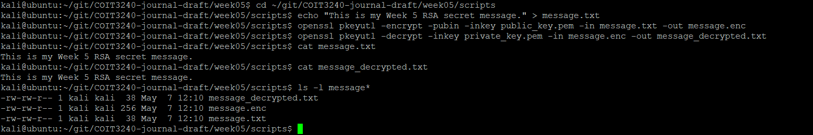
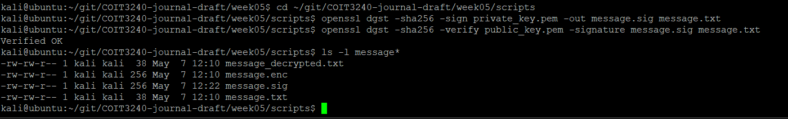

# Week 05

## Task 1 – RSA Key Generation

RSA is an asymmetric encryption algorithm that uses two keys:
- Public key
- Private key

The public key can be shared publicly, while the private key must remain secret.

I manually generated an RSA key pair using small prime numbers.

Chosen primes:
- p = 181
- q = 191

Calculated values:
- n = p × q = 34571
- Φ(n) = (181 - 1)(191 - 1) = 34200

Chosen public exponent:
- e = 7

Calculated private exponent:
- d = 19543

Public key:
- PU = (e = 7, n = 34571)

Private key:
- PR = (d = 19543, n = 34571)

Values that must remain secret:
- d
- p
- q

Values that may be public:
- e
- n

RSA is more secure than classical symmetric encryption because different keys are used for encryption and decryption.

---

## Task 2 – RSA Encryption and Decryption

I tested RSA encryption and decryption using the RSA key pair generated previously.

Chosen plaintext:
- M = 123

Encryption formula:

:contentReference[oaicite:0]{index=0}

Calculated ciphertext:
- C = 6238

Decryption formula:

:contentReference[oaicite:1]{index=1}

After decrypting the ciphertext using the private key, the original plaintext value 123 was successfully recovered.

This demonstrated how RSA uses the public key for encryption and the private key for decryption.

---

## Task 3 – RSA Keys in OpenSSL

I generated a real RSA key pair using OpenSSL. I used a 2048-bit RSA private key and then extracted the matching public key.

Commands used

openssl genpkey -algorithm RSA -pkeyopt rsa_keygen_bits:2048 -out private_key.pem

openssl pkey -in private_key.pem -pubout -out public_key.pem

ls -l *.pem

## Task 4 – RSA Encryption in OpenSSL

I used OpenSSL to encrypt and decrypt a text message using RSA public and private keys.

First, I created a plaintext fileusing 
echo "This is my Week 5 RSA secret message." > message.txt
The message was encrypted using the RSA public key:
openssl pkeyutl -encrypt -pubin -inkey public_key.pem -in message.txt -out message.enc

The encrypted message was then decrypted using the RSA private key
openssl pkeyutl -decrypt -inkey private_key.pem -in message.enc -out message_decrypted.txt
The decrypted output has been matched with the original plaintext message which demonstrates successful RSA encryption and decryption using OpenSSL 

---
## Task 4 – RSA Encryption in OpenSSL

I used OpenSSL to encrypt and decrypt a confidential text message using RSA public and private keys.

First, I created a plaintext message file using

openssl pkeyutl -encrypt -pubin -inkey public_key.pem -in message.txt -out message.enc

This generated an encrypted ciphertext file named `message.enc`. The ciphertext could not be read directly because the plaintext had been transformed into encrypted binary data.

Next, I decrypted the ciphertext using the RSA private key:

openssl pkeyutl -decrypt -inkey private_key.pem -in message.enc -out message_decrypted.txt

After decryption, the original plaintext message was successfully recovered inside `message_decrypted.txt`.

This activity demonstrated how RSA public key cryptography provides confidentiality. The public key is used for encryption, while only the matching private key can decrypt the message.

---

## Task 5 – Digital Signatures in OpenSSL

I created and verified a digital signature using OpenSSL and RSA keys.

First, I generated a SHA-256 digital signature for the plaintext message using the RSA private key:

openssl dgst -sha256 -sign private_key.pem -out message.sig message.txt

This produced a signature file called `message.sig`.

Next, I verified the signature using the RSA public key:

openssl dgst -sha256 -verify public_key.pem -signature message.sig message.txt

The verification result displayed:

Verified OK

This confirmed that:
- the message had not been modified
- the signature was created using the correct private key

Digital signatures provide authenticity and integrity. If the message contents are changed, the signature verification process will fail.

This activity demonstrated an important difference between encryption and digital signatures:
- RSA encryption protects confidentiality
- RSA digital signatures verify authenticity and integrity

---

## Reflection

This week introduced public key cryptography and RSA encryption. Unlike symmetric encryption algorithms such as AES, RSA uses two separate keys: a public key and a private key. This allows secure communication without needing to share a secret decryption key beforehand.

The manual RSA calculations helped me understand how the mathematical relationships between p, q, n, e and d are used to generate the RSA key pair. Python was useful for verifying calculations involving modular arithmetic and confirming that encryption and decryption worked correctly.

Using OpenSSL provided practical experience with real RSA implementations. I learned how to:
- generate RSA key pairs
- extract public keys
- encrypt and decrypt messages
- create and verify digital signatures

One important insight from this week was the difference between confidentiality and authenticity:
- Encryption protects confidential information from unauthorized access.
- Digital signatures verify the sender and confirm that the message has not been modified.

The practical OpenSSL activities demonstrated how RSA is used in real-world technologies such as HTTPS, SSH, certificates and secure communications systems.
