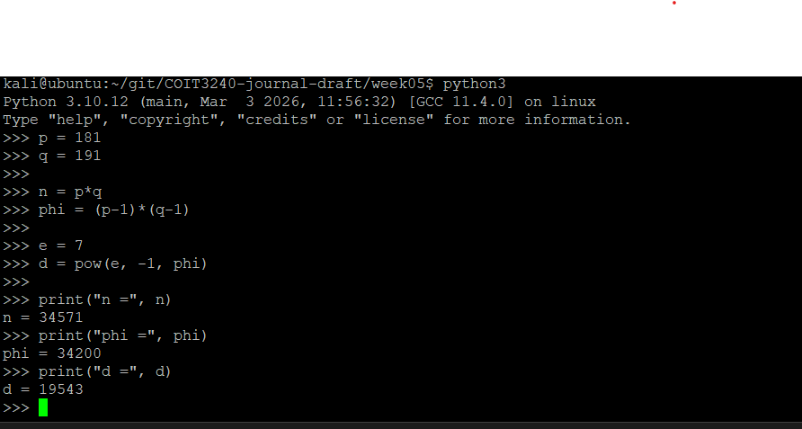
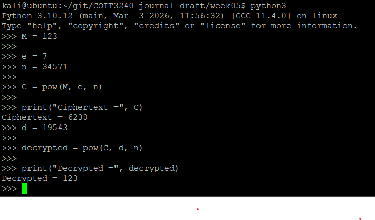

# Week 05

## Task 1 – RSA Key Generation

RSA is an asymmetric encryption algorithm that uses two keys:
- Public key
- Private key

The public key can be shared, while the private key must remain secret.

I manually generated an RSA key pair using small prime numbers.

Chosen primes:
- p = 181
- q = 191

Calculated values:
- n = p × q = 34571
- Φ(n) = (181 - 1)(191 - 1) = 34200

Chosen public exponent:
- e = 7

Calculated private exponent:
- d = 19543

Public key:
- PU = (e = 7, n = 34571)

Private key:
- PR = (d = 19543, n = 34571)

Values that must remain secret:
- d
- p
- q

Values that may be public:
- e
- n

RSA is more secure than classical symmetric encryption because different keys are used for encryption and decryption.


---

## Task 2 – RSA Encryption and Decryption

I tested RSA encryption and decryption using the RSA key pair generated previously.

Chosen plaintext:
- M = 123

Encryption formula:

C = M^e mod n

Calculated ciphertext:
- C = 6238

Decryption formula:

M = C^d mod n

After decrypting the ciphertext using the private key, the original plaintext value 123 was successfully recovered.

This demonstrated how RSA uses the public key for encryption and the private key for decryption.


---

## Task 3 – RSA Keys in OpenSSL

I generated a real RSA key pair using OpenSSL. I used a 2048-bit RSA private key and then extracted the matching public key.

Commands used:

```bash
openssl genpkey -algorithm RSA -pkeyopt rsa_keygen_bits:2048 -out private_key.pem
openssl pkey -in private_key.pem -pubout -out public_key.pem
ls -l *.pem

- p
---

## Task 4 – RSA Encryption in OpenSSL

I used OpenSSL to encrypt and decrypt a text message using RSA public and private keys.

First, I created a plaintext file:

```bash
echo "This is my Week 5 RSA secret message." > message.txt
The message was encrypted using the RSA public key:
openssl pkeyutl -encrypt -pubin -inkey public_key.pem -in message.txt -out message.enc

The encrypted message was then decrypted using the RSA private key:
openssl pkeyutl -decrypt -inkey private_key.pem -in message.enc -out message_decrypted.txt

The decrypted output matched the original plaintext message, demonstrating successful RSA encryption and decryption using OpenSSL.
---

## Reflection

This week introduced public key cryptography and RSA. Unlike symmetric encryption, RSA uses separate public and private keys. This allows secure communication without sharing a secret decryption key.

The manual RSA calculations helped me understand how the mathematical relationships between p, q, n, e and d create the key pair. Python was useful for verifying calculations and modular arithmetic.

Using OpenSSL demonstrated how RSA is used practically for key generation, encryption, decryption and digital signatures. The digital signature activity showed that RSA can provide authenticity and integrity in addition to confidentiality.

One important insight was that encryption and digital signatures serve different purposes:
- Encryption protects confidentiality.
- Digital signatures verify authenticity and integrity.

Modern systems such as HTTPS, SSH and certificates depend heavily on RSA and public key cryptography.
