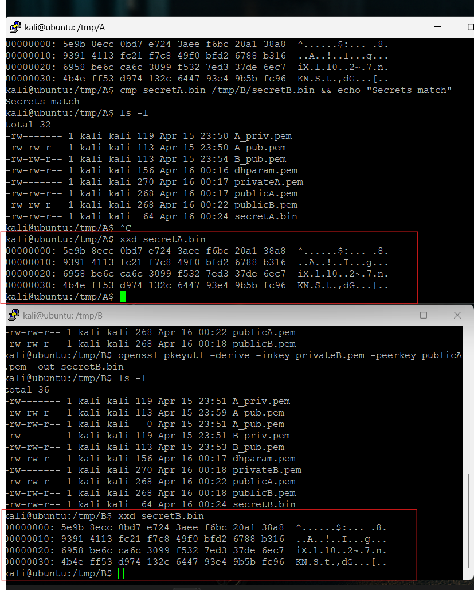
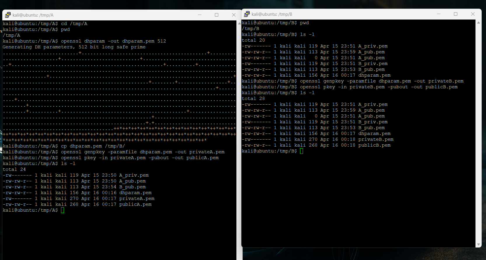
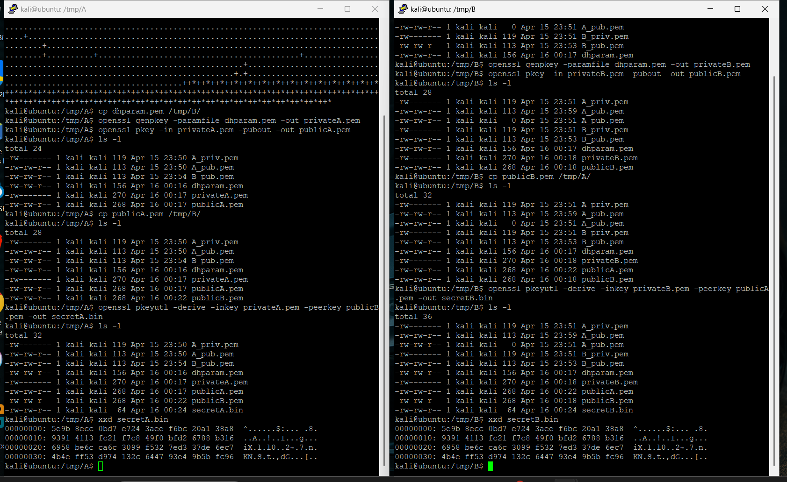
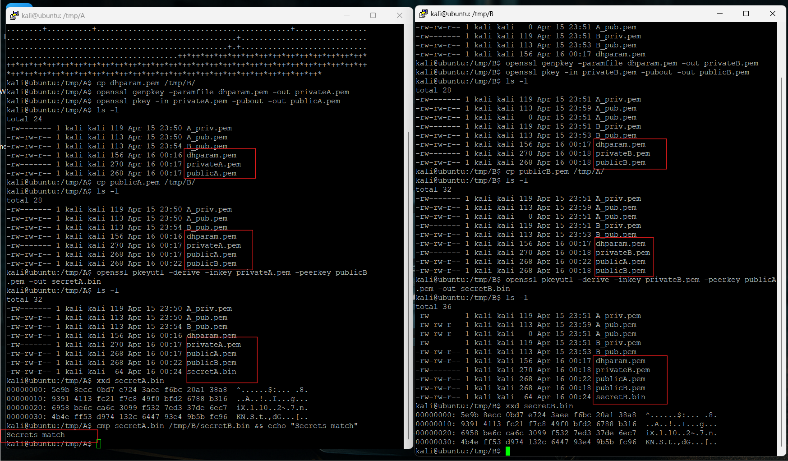
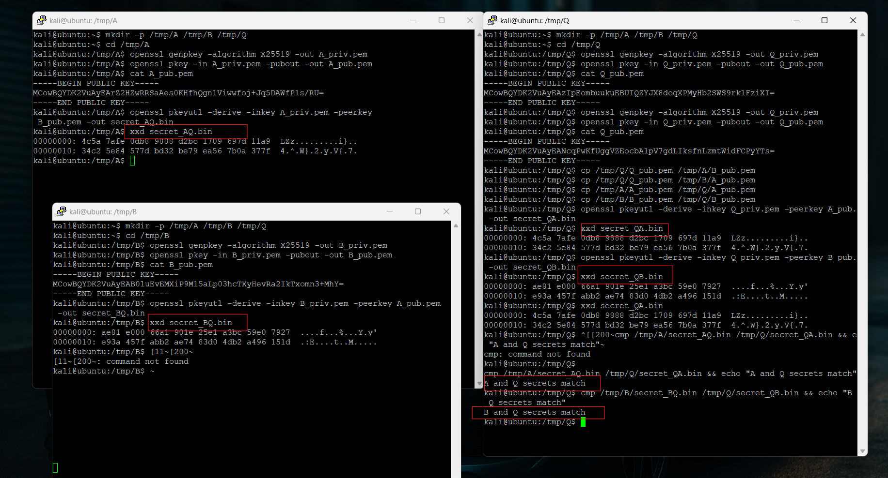

# Week 06

## Task 1 – Diffie-Hellman Key Exchange (DHKE)

Diffie-Hellman Key Exchange (DHKE) is a public key cryptography method that allows two users to generate a shared secret over an insecure network.

Unlike RSA, DHKE is not used directly for encryption. Instead, it is used to securely establish a shared secret key that can later be used with symmetric encryption algorithms such as AES.

The main idea behind DHKE is:
- both users generate private keys
- both users exchange public keys
- both users independently calculate the same shared secret

An attacker can see the public keys but should not be able to calculate the shared secret without the private keys.

One important security concept in DHKE is the difficulty of solving the discrete logarithm problem, which makes deriving the private key computationally difficult.

---

## Task 2 – OpenSSL Diffie-Hellman Key Exchange

I performed a practical Diffie-Hellman Key Exchange using OpenSSL between two users:
- User A
- User B

First, DH parameters were generated using OpenSSL:

openssl dhparam -out dhparam.pem 512

The DH parameters were then copied between both users so they could use the same mathematical values during the exchange.

Next, both users generated their private and public keys:

openssl genpkey -paramfile dhparam.pem -out privateA.pem
openssl pkey -in privateA.pem -pubout -out publicA.pem

openssl genpkey -paramfile dhparam.pem -out privateB.pem
openssl pkey -in privateB.pem -pubout -out publicB.pem

The public keys were exchanged between both users.

Each user then derived a shared secret:

openssl pkeyutl -derive -inkey privateA.pem -peerkey publicB.pem -out secretA.bin

openssl pkeyutl -derive -inkey privateB.pem -peerkey publicA.pem -out secretB.bin

The shared secret values were examined using:

xxd secretA.bin

xxd secretB.bin

Finally, both secrets were compared using:

cmp secretA.bin /tmp/B/secretB.bin && echo "Secrets match"

The output displayed:

Secrets match

This confirmed that both users independently generated the same shared secret even though the secret itself was never transmitted across the network.

---

## Task 3 – Man-in-the-Middle (MITM) Attack on DHKE

I performed a Man-in-the-Middle (MITM) attack simulation on Diffie-Hellman Key Exchange using three users:
- A
- B
- Q (attacker)

Normally, users A and B exchange public keys directly and generate the same shared secret.

In this attack:
- Q intercepted the public keys
- Q replaced A’s public key with Q’s own public key
- Q replaced B’s public key with Q’s own public key

As a result:
- A generated a secret shared with Q
- B generated a different secret shared with Q
- A and B no longer shared the same secret directly

The following shared secrets were generated:
- secret_AQ.bin
- secret_QA.bin
- secret_BQ.bin
- secret_QB.bin

The outputs confirmed:
- A and Q secrets matched
- B and Q secrets matched

This demonstrated that the attacker Q successfully inserted themselves between the communication process.

The attack works because standard Diffie-Hellman by itself does not authenticate public keys. Without authentication, users cannot verify whether the received public key actually belongs to the intended user.

This is why real-world systems combine DHKE with:
- certificates
- digital signatures
- authentication protocols

to prevent MITM attacks.

---

## Reflection

This week helped me understand how secure shared secrets can be generated using public key cryptography without directly transmitting the secret itself.

The practical OpenSSL activities demonstrated how Diffie-Hellman Key Exchange works in real systems. I learned how to:
- generate DH parameters
- create private and public keys
- exchange public keys
- derive shared secrets
- verify matching secrets

The MITM attack activity was the most important part because it demonstrated a major weakness of unauthenticated Diffie-Hellman.

One important insight was that encryption alone is not always enough for security. Even though Diffie-Hellman securely creates shared secrets, attackers can still intercept communications if authentication is missing.

This week also helped me understand why modern protocols such as:
- TLS
- HTTPS
- SSH

combine key exchange algorithms with certificates and digital signatures to prevent impersonation and MITM attacks.

Overall, the practical exercises improved my understanding of public key cryptography, secure key exchange and real-world network security concepts.
