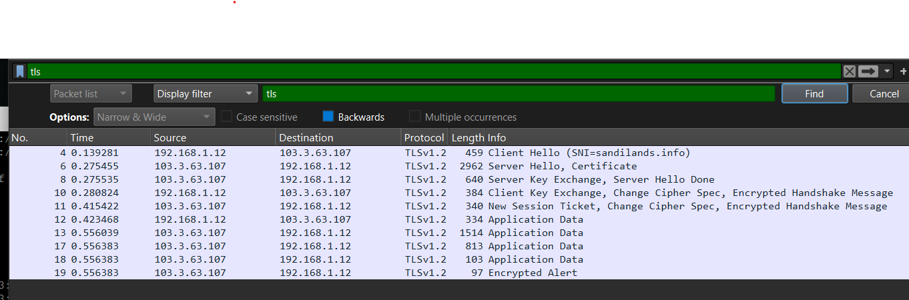
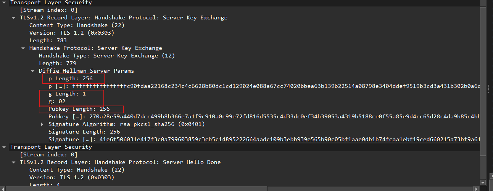
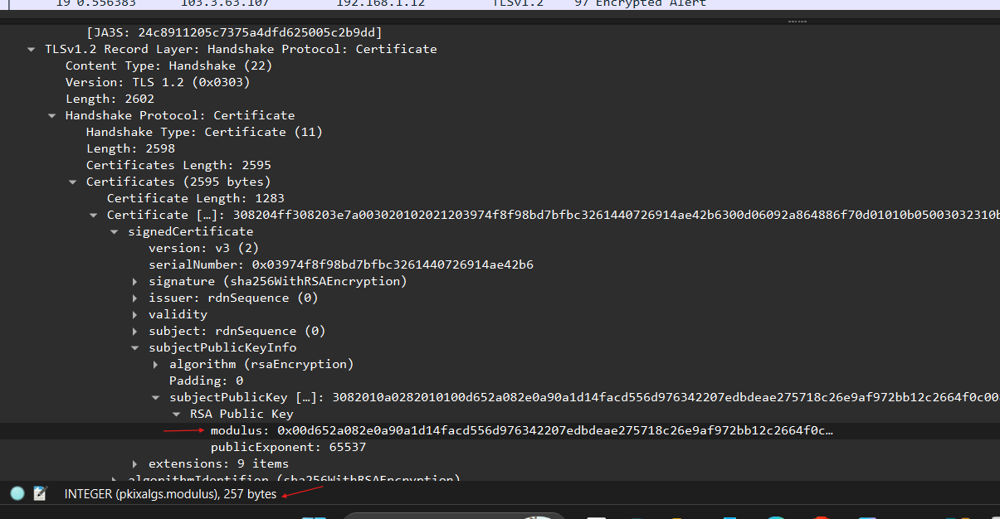

# Week 07

## Task 1 – TLS and Wireshark Analysis

This week focused on analysing Transport Layer Security (TLS) traffic using Wireshark.

TLS is a cryptographic protocol used to secure communications over networks such as the Internet. TLS provides:
- confidentiality
- integrity
- authentication

Modern protocols such as HTTPS use TLS to protect transmitted data between clients and servers.

I opened the provided TLS packet capture file in Wireshark and analysed the TLS 1.2 handshake process.

The packet list showed the major TLS handshake stages:
- Client Hello
- Server Hello
- Certificate
- Server Key Exchange
- Client Key Exchange
- Change Cipher Spec
- Encrypted Handshake Message

Initially the Wireshark output looked confusing because many packets and protocol fields were displayed at once. After following the TLS handshake sequence step-by-step, I understood how the client and server negotiate cryptographic settings before encrypted communication begins.

The Client Hello packet contained supported cryptographic groups and cipher negotiation information used during the TLS connection setup.

Supported groups included:
- secp256r1
- x25519
- ffdhe2048
- ffdhe4096
- ffdhe6144
- ffdhe8192

This demonstrated how the client advertises supported cryptographic algorithms and key exchange groups to the server during the handshake process.

I also noticed that TLS does not rely on a single cryptographic algorithm. Instead, multiple algorithms work together during authentication, key exchange and encrypted communication.

---

## Task 2 – TLS Server Key Exchange Analysis

I analysed the TLS Server Key Exchange packet inside Wireshark.

The Server Key Exchange packet contained Diffie-Hellman parameters used during the TLS handshake process.

The packet included:
- p Length
- g Length
- Public Key Length

These values showed that the TLS session was using Diffie-Hellman key exchange to establish a shared secret between the client and server.

The public key information could be transmitted openly, while the actual shared secret remained protected.

Before this activity I assumed TLS encryption started immediately after the connection began. After analysing the handshake packets, I understood that TLS first performs negotiation and key exchange before encrypted application data can be transmitted securely.

This activity also helped reinforce concepts from Week 06 because I could now observe Diffie-Hellman key exchange being used inside a real-world security protocol.

---

## Task 3 – TLS Certificate and RSA Public Key

I analysed the TLS certificate packet inside Wireshark.

The certificate contained the server public key information and RSA certificate details used for authentication.

The certificate packet showed:
- RSA public key
- modulus value
- public exponent
- certificate information

This demonstrated how TLS uses certificates and public key cryptography to authenticate servers and prevent impersonation attacks.

The RSA public key allows clients to verify the identity of the server before encrypted communication begins.

One thing I found interesting was that the server certificate can be viewed publicly during the handshake process, while the private key always remains secret on the server.

I also observed that TLS combines both asymmetric and symmetric cryptography:
- public key cryptography is mainly used during authentication and key exchange
- symmetric encryption is later used for fast encrypted communication

---

## Reflection

This week improved my understanding of how TLS secures real-world Internet communications.

Using Wireshark allowed me to observe the actual TLS handshake process and analyse how multiple cryptographic techniques work together during secure communication establishment.

One important insight was that TLS combines several security mechanisms together:
- certificates for authentication
- Diffie-Hellman for key exchange
- symmetric encryption for encrypted data transmission

At first I viewed TLS as simply “encrypted Internet traffic.” After analysing the handshake process in detail, I understood that TLS involves multiple stages including:
- negotiation
- authentication
- key exchange
- session establishment
- encrypted communication

The packet analysis demonstrated that public key cryptography is mainly used during the handshake stage, while symmetric encryption protects the actual application data afterwards because symmetric encryption is faster and more efficient.

This week also helped connect previous topics together:
- RSA from Week 05
- Diffie-Hellman from Week 06
- symmetric encryption from Week 04

Seeing these concepts combined inside TLS made the earlier cryptography activities much more meaningful.

Overall, the practical Wireshark analysis improved my understanding of:
- TLS handshakes
- HTTPS security
- certificates
- Diffie-Hellman key exchange
- RSA authentication
- secure network communication

The activities demonstrated how modern Internet security depends on combining multiple cryptographic techniques together rather than relying on a single algorithm alone.
