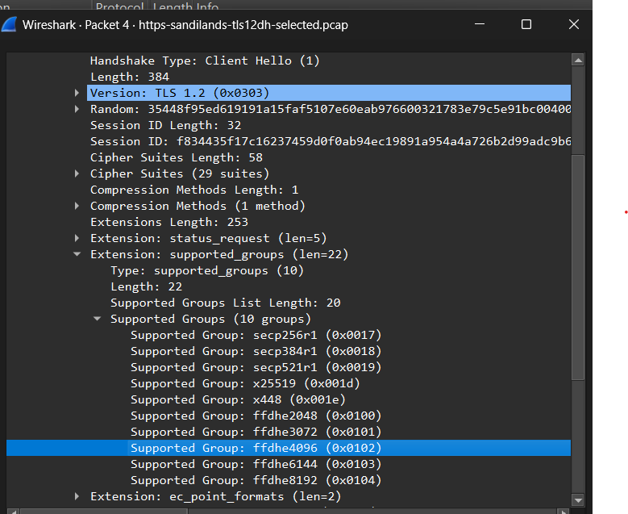

# Week 07

## Task 1 – TLS and Wireshark Analysis

This week focused on analysing Transport Layer Security (TLS) traffic using Wireshark.

TLS is a cryptographic protocol used to secure communications over networks such as the Internet. TLS provides:

- confidentiality
- integrity
- authentication

Modern protocols such as HTTPS use TLS to protect transmitted data between clients and servers.

I opened the provided TLS packet capture file in Wireshark and analysed the TLS 1.2 handshake process.

The packet list showed the major TLS handshake stages:

- Client Hello
- Server Hello
- Certificate
- Server Key Exchange
- Client Key Exchange
- Change Cipher Spec
- Encrypted Handshake Message

The Client Hello packet contained the supported cryptographic groups and cipher negotiation information used during the TLS connection setup.

Supported groups included:

- secp256r1
- x25519
- ffdhe2048
- ffdhe4096
- ffdhe6144
- ffdhe8192

This demonstrated how the client advertises supported cryptographic algorithms and key exchange groups to the server.

---

## Task 2 – TLS Server Key Exchange Analysis

I analysed the TLS Server Key Exchange packet inside Wireshark.

The Server Key Exchange packet contained Diffie-Hellman parameters used during the TLS handshake process.

The packet included:

- p Length
- g Length
- Public Key Length

The values showed that the TLS session was using Diffie-Hellman key exchange to establish a shared secret between the client and server.

The public key information could be transmitted openly, while the actual shared secret remained protected.

This demonstrated how TLS uses public key cryptography during the handshake process to securely establish encryption keys for later communication.

---

## Task 3 – TLS Certificate and RSA Public Key

I analysed the TLS certificate packet inside Wireshark.

The certificate contained the server public key information and RSA certificate details used for authentication.

The certificate packet showed:

- RSA public key
- modulus value
- public exponent
- certificate information

This demonstrated how TLS uses certificates and public key cryptography to authenticate servers and prevent impersonation attacks.

The RSA public key allows clients to verify the identity of the server before encrypted communication begins.

---

## Reflection

This week improved my understanding of how TLS secures real-world Internet communications.

Using Wireshark allowed me to observe the actual TLS handshake process and analyse how multiple cryptographic techniques work together during secure communication establishment.

One important insight was that TLS combines several security mechanisms together:

- certificates for authentication
- Diffie-Hellman for key exchange
- symmetric encryption for encrypted data transmission

The packet analysis demonstrated that public key cryptography is mainly used during the handshake stage, while symmetric encryption protects the actual application data afterwards because symmetric encryption is faster and more efficient.

The practical Wireshark analysis helped connect theoretical cryptography concepts from previous weeks to real-world implementations used in HTTPS, secure websites and encrypted network communications.
