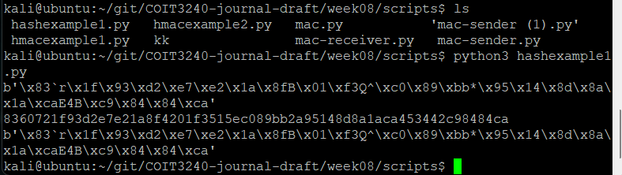
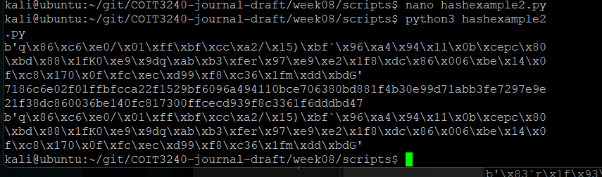
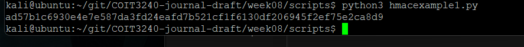
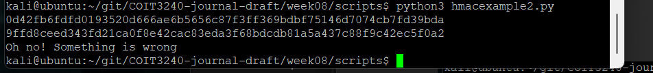
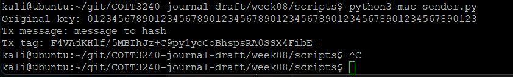
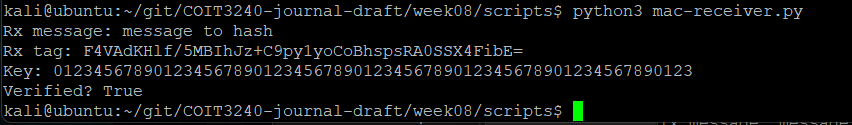
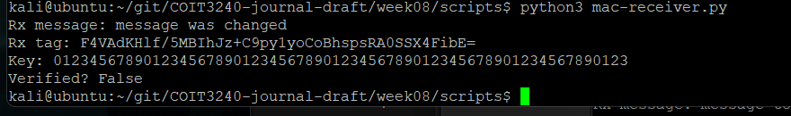

# Week 08

## Task 1 – Hash Functions

A cryptographic hash function converts input data into a fixed-length output called a hash or digest.

Hash functions are designed to:
- produce a unique output for different inputs
- behave as one-way functions
- detect changes to data

I tested a SHA256 hash function in Python using the `cryptography` library.

The program generated a SHA256 hash value for the plaintext message:
- `"Steven"`

The output displayed:
- the raw byte hash value
- the hexadecimal hash value

Even a very small change to the plaintext produced a completely different hash output.

Initially I expected similar plaintext values to produce similar hashes. After testing different messages, I observed that hash outputs changed completely even when only one character was modified.

This demonstrated an important security property known as the avalanche effect.



---

## Task 2 – Modified Hash Function

I modified the original hash example by:
- changing SHA256 to SHA512
- changing the plaintext message

The modified program generated a longer hash value because SHA512 produces a 512-bit digest instead of a 256-bit digest.

This activity demonstrated that:
- different hash algorithms produce different digest lengths
- changing the input message completely changes the hash output

While comparing SHA256 and SHA512 outputs, I noticed that the hash values appeared random even though the same algorithm always produces the same result for identical input data.

This activity reinforced the idea that cryptographic hashes are deterministic but highly sensitive to input changes.



---

## Task 3 – HMAC Example

HMAC stands for Hash-based Message Authentication Code.

Unlike normal hashing, HMAC uses:
- a cryptographic hash function
- a shared secret key

This allows both integrity and authentication to be verified.

I tested HMAC generation using Python and SHA256.

The program:
- used a secret key
- generated an authentication tag for a message

The generated HMAC value can later be verified by another user who also knows the shared secret key.

At first I thought HMAC simply encrypted the message. After analysing the output more carefully, I understood that HMAC does not hide the message contents. Instead, it verifies authenticity and integrity.



---

## Task 4 – HMAC Verification

I tested HMAC verification using Python.

The program:
- generated an HMAC tag
- verified the received message and tag
- tested what happens when the message changes

When the original message was verified, the authentication process succeeded.

After modifying the message, the verification process failed and displayed:

```text
Oh no! Something is wrong
```

This demonstrated that HMAC can detect message modification and protect data integrity.

One thing I found interesting was that the message itself remained readable, but any small modification caused the verification process to fail immediately.



---

## Task 5 – MAC Sender

I tested a Message Authentication Code (MAC) sender program.

The sender program:
- created a plaintext message
- generated a MAC tag using a shared secret key

The output displayed:
- the original secret key
- transmitted message
- generated MAC tag

The MAC tag can later be verified by the receiver.

This activity demonstrated how secure systems can verify whether transmitted data has been modified during communication.



---

## Task 6 – MAC Receiver Verification

I tested the MAC receiver verification program.

The receiver:
- received the message
- received the MAC tag
- verified the integrity of the message

The verification result displayed:

```text
Verified? True
```

This confirmed that:
- the message was authentic
- the message contents were unchanged

I noticed that successful verification depended on:
- the correct message
- the correct MAC tag
- the correct shared secret key

If any of these values changed, verification would fail.



---

## Task 7 – Modified Message Detection

I modified the received message while keeping the original MAC tag unchanged.

After verification, the output displayed:

```text
Verified? False
```

This demonstrated that:
- changing the message invalidates the MAC
- MAC verification can detect tampering
- integrity protection prevents unauthorized message modification

Initially I assumed attackers might still be able to slightly modify messages without detection. After testing the modified message directly, I understood how sensitive MAC verification is to message changes.



---

## Reflection

This week introduced cryptographic hash functions, HMACs and message authentication codes.

The practical Python activities demonstrated how hashing can verify data integrity and how HMAC adds authentication using a shared secret key.

One important observation was that hash functions are deterministic:
- the same input always produces the same output
- even a very small change completely changes the hash value

The HMAC and MAC activities demonstrated how integrity and authentication are implemented in real communication systems.

Initially I confused encryption with authentication because both involve cryptographic algorithms. After completing the activities, I understood the difference more clearly:
- encryption protects confidentiality
- hashes verify integrity
- HMAC verifies integrity and authentication

The modified message verification task was especially useful because it demonstrated that attackers cannot modify protected messages without detection when MAC protection is used correctly.

This week also helped me understand how these concepts are used in:
- TLS
- HTTPS
- APIs
- secure communications
- authentication systems

Overall, the practical exercises improved my understanding of:
- hash functions
- SHA256 and SHA512
- avalanche effect
- HMAC authentication
- MAC verification
- integrity protection
- message tampering detection

The activities demonstrated that secure communication systems require integrity checking and authentication in addition to encryption.
