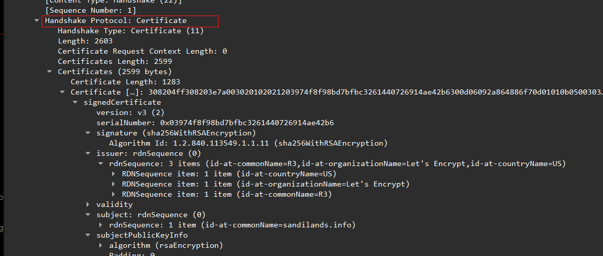
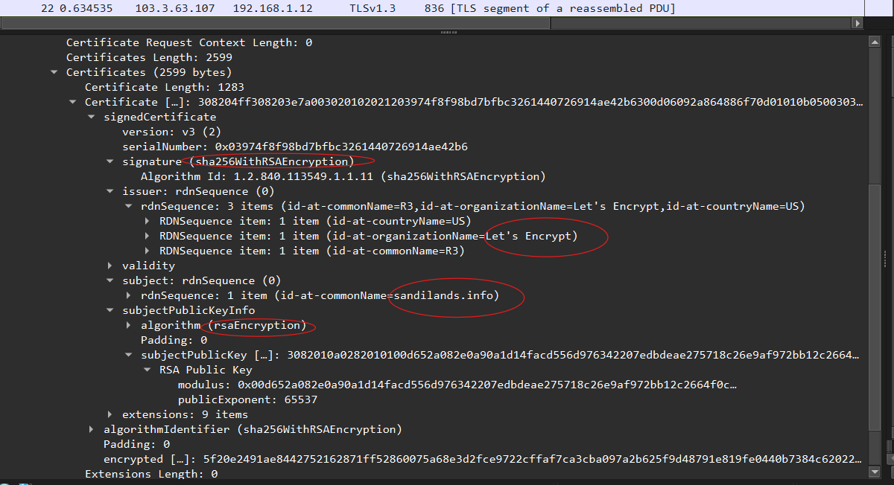
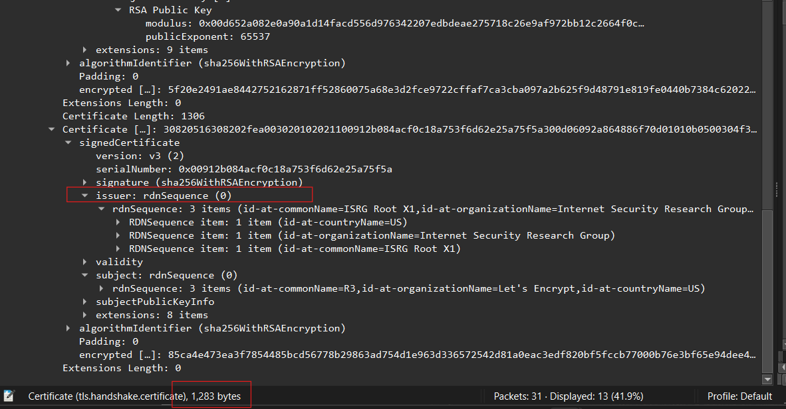

# Week 09

## Task 1 – Web Server Certificates in TLS

This week focused on authentication and data integrity in secure network communication.

The tutorial explored how TLS uses digital certificates to authenticate web servers and how multiple cryptographic mechanisms work together to create secure communication systems.

I analysed a TLS 1.3 packet capture using Wireshark to inspect the web server certificate and related TLS handshake messages.

Initially I found the TLS 1.3 packet capture slightly confusing because many handshake messages appeared encrypted. After loading the SSL key log file into Wireshark, I was able to decrypt the TLS traffic and inspect the certificate details properly.

This activity demonstrated that TLS does not only provide encryption. It also provides:
- authentication
- integrity protection
- secure key exchange

---

## TLS Certificate Analysis

The TLS packet capture contained encrypted HTTPS communication between a client and the web server:

`sandilands.info`

Using the `tls` display filter in Wireshark, I located the TLS Certificate message within the TLS handshake process.

The certificate message contained:
- the web server certificate
- the intermediate certificate
- the server public key
- issuer information
- signature information

While analysing the certificate contents, I noticed that the server certificate itself is public information. The private key always remains securely stored on the web server.

---

## Certificate Information

### 1. Packet Containing the Certificate

The web server certificate was located inside the TLS Handshake Protocol Certificate message.

### 2. Subject (Common Name)

The subject common name was:

```text
sandilands.info
```

### 3. Issuer

The certificate issuer was:

```text
Let's Encrypt
```

The intermediate certificate referenced:
- R3
- ISRG Root X1

### 4. Public Key Owner

The public key inside the certificate belongs to the web server:

```text
sandilands.info
```

### 5. Public Key Algorithm

The public key algorithm used was:

```text
RSA
```

### 6. Public Key Value

The RSA public key included:
- modulus value
- public exponent

The exponent value was:

```text
65537
```

The modulus was displayed as a long hexadecimal value inside the certificate details.

### 7. Certificate Signature

The certificate was digitally signed by:

```text
Let's Encrypt
```

### 8. Signature Algorithm

The signature algorithm used was:

```text
sha256WithRSAEncryption
```

### 9. Other Certificate in the Message

The TLS message also contained an intermediate certificate related to:
- R3
- ISRG Root X1

This formed part of the certificate trust chain.

### 10. Web Server Authentication

The web browser authenticates the web server using:
- trusted Certificate Authorities (CAs)
- digital signatures
- certificate validation
- trust chains

The browser checks:
- whether the certificate is signed by a trusted CA
- whether the domain name matches
- whether the certificate has expired
- whether the certificate signature is valid

If these checks succeed, the browser trusts that it is communicating with the legitimate web server rather than an attacker.

Before this activity I assumed browsers simply accepted certificates automatically. After analysing the certificate chain process, I understood how browsers validate trust using Certificate Authorities and intermediate certificates.

---

## Wireshark TLS Certificate Analysis

The following screenshots show the TLS Certificate message and certificate details identified in Wireshark.







---

## Task 2 – Crypto Mechanisms in Python

The second part of the tutorial focused on reviewing different cryptographic mechanisms implemented using Python and OpenSSL.

I reviewed practical examples involving:
- symmetric encryption
- public key cryptography
- key exchange
- message authentication

The examples demonstrated how modern secure systems combine multiple cryptographic mechanisms together rather than relying on a single algorithm.

This helped connect concepts from previous weeks including:
- AES encryption
- RSA
- Diffie-Hellman
- HMAC authentication

---

## Symmetric Encryption

AES symmetric encryption is used to provide confidentiality by encrypting plaintext using a shared secret key.

The same key is required for both encryption and decryption.

AES is commonly used in:
- TLS
- VPNs
- secure file storage
- encrypted communication systems

One important observation from previous activities was that symmetric encryption is much faster than public key cryptography, which is why TLS mainly uses symmetric encryption after the handshake phase is completed.

---

## RSA Digital Signatures

RSA can be used for:
- public key encryption
- digital signatures
- authentication

Digital signatures allow users to verify:
- message authenticity
- message integrity
- sender identity

RSA signatures are heavily used in:
- TLS certificates
- software signing
- secure email systems

This connected directly with the certificate analysis because the TLS certificate itself used RSA-based signatures for authentication.

---

## Diffie-Hellman Key Exchange

Diffie-Hellman allows two users to securely establish a shared secret over an insecure network.

The secret itself is never directly transmitted.

This mechanism is widely used in:
- TLS
- HTTPS
- SSH
- VPN protocols

The lecture material also introduced forward secrecy, where temporary session keys help protect previously encrypted communications even if long-term keys are compromised later.

---

## HMAC Authentication

HMAC combines:
- a secret key
- a cryptographic hash function

to create a Message Authentication Code (MAC).

HMAC provides:
- integrity verification
- message authentication

If the message changes, verification fails.

HMAC is commonly used in:
- TLS
- APIs
- authentication systems
- secure network protocols

This reinforced concepts from Week 08 where message modifications caused MAC verification to fail immediately.

---

## Combining Cryptographic Mechanisms

This tutorial demonstrated that secure communication systems rely on multiple cryptographic mechanisms working together.

For example, TLS combines:
- certificates for authentication
- RSA or ECDSA for signatures
- Diffie-Hellman for key exchange
- AES for encryption
- HMAC or authenticated encryption for integrity

Each mechanism solves a different security problem.

Initially I viewed TLS as simply encrypted communication. After analysing the handshake and certificates in detail, I understood that secure systems depend on multiple layers of cryptographic protection working together.

---

## Reflection

This week helped me better understand how authentication and integrity are implemented in real secure communication systems.

By analysing TLS certificates in Wireshark, I learned how web browsers authenticate web servers using:
- certificate authorities
- digital signatures
- certificate chains

I also gained a much clearer understanding of how different cryptographic mechanisms work together rather than operating independently.

One important insight was that encryption alone is not sufficient for security. Secure systems also require:
- authentication
- integrity protection
- trusted certificates
- secure key exchange

Initially I thought HTTPS security mainly depended on encryption algorithms such as AES. After completing the TLS analysis, I understood that certificates, trust chains and digital signatures are equally important for preventing impersonation attacks.

This week also helped connect many earlier cryptography concepts together:
- symmetric encryption from Week 04
- RSA from Week 05
- Diffie-Hellman from Week 06
- HMAC authentication from Week 08

Overall, this week improved my understanding of:
- TLS authentication
- digital certificates
- trust chains
- RSA signatures
- secure key exchange
- HTTPS security
- cryptographic integration
- secure network communication

The activities demonstrated how modern Internet security depends on combining multiple cryptographic techniques together rather than relying on a single security mechanism.
