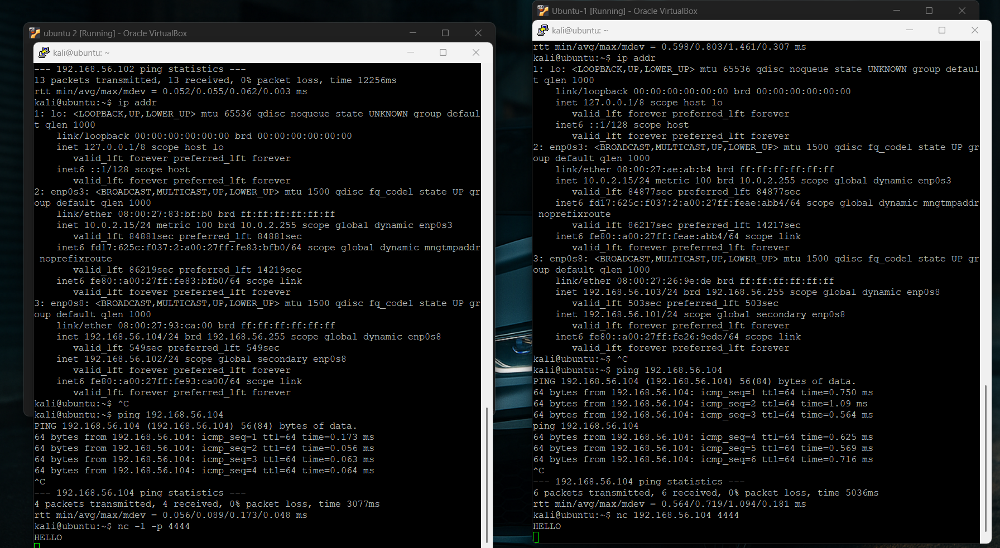
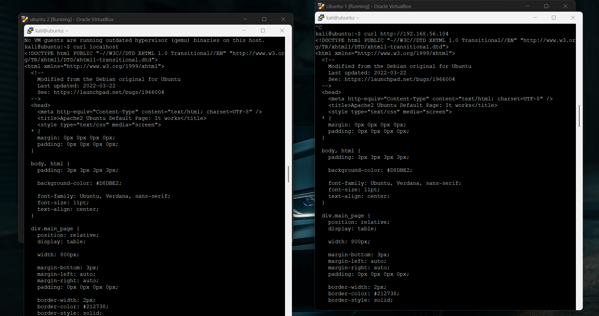
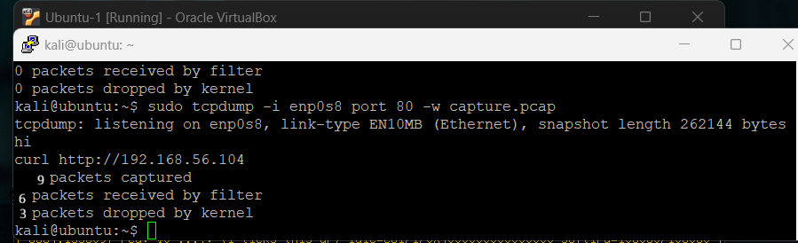
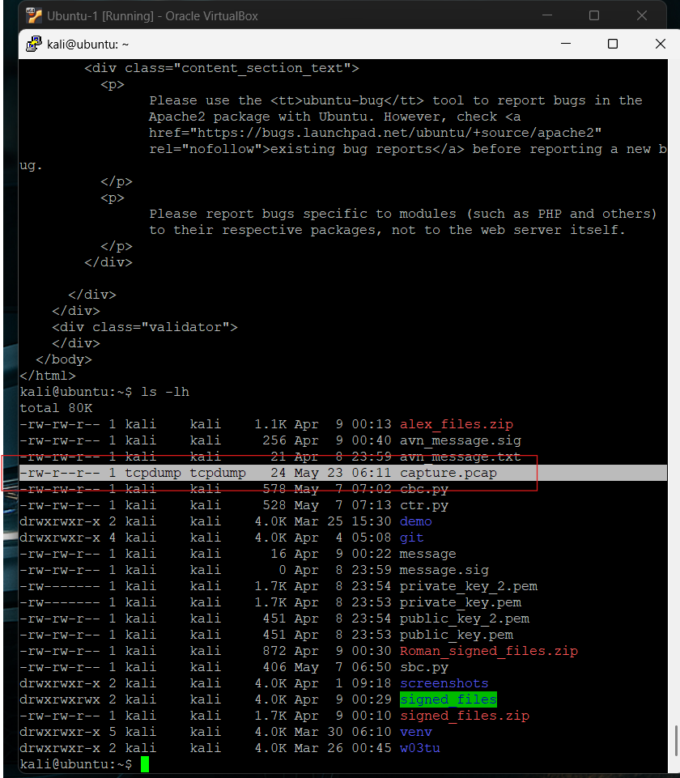

# Week 10 Tutorial – Quantum Computing, Cryptography and Security Project Progress Journal

## Objective

The objective of this week’s tutorial was to develop an understanding of quantum computing concepts relevant to modern cryptography while continuing practical progress on the security project. The tutorial activities focused on discussing the potential impact of quantum computing on cryptographic systems, as well as implementing practical networking and security tasks using Ubuntu virtual machines within Oracle VirtualBox.

The practical component of the tutorial involved configuring communication between virtual machines, testing network connectivity, establishing TCP communication, configuring an Apache web server, and capturing network traffic using packet analysis tools.

---

# Part 1 – Quantum Computing and Cryptography Discussion

## Introduction

Quantum computing is an emerging area of computing that uses the principles of quantum mechanics to process information differently from classical computers. Unlike classical computers, which use binary bits represented as either 0 or 1, quantum computers use qubits, which can exist in multiple states simultaneously through a concept known as superposition.

During the tutorial, several important concepts related to quantum computing and cryptography were discussed to develop an understanding of how future quantum systems may affect modern encryption algorithms and cybersecurity.

---

# 1. Qubits and Superposition

A classical bit can only exist in one of two states:

- 0
- 1

However, a quantum bit, or qubit, can exist in a combination of both states simultaneously. This is known as superposition.

For example, a qubit represented as:

```text
0.8|0> + 0.6|1>
```

exists in both states until measurement occurs. Once measured, the qubit collapses into either state 0 or state 1. The probability of each result depends on the amplitude associated with each state.

This capability allows quantum computers to process many possibilities simultaneously, making them significantly different from classical computers.

---

# 2. Quantum Computing and Cryptography

Quantum computing has the potential to impact modern cryptographic systems significantly. One important discussion point was the effect of quantum computing on symmetric encryption algorithms such as AES.

Quantum computers can reduce the time required for brute-force attacks using Grover’s algorithm. Although this does not completely break AES encryption, it effectively reduces the security strength of symmetric keys. Larger AES key sizes are therefore recommended to improve resistance against future quantum attacks.

Another important topic discussed was Shor’s algorithm. Shor’s algorithm is capable of factoring very large numbers efficiently, meaning that public-key cryptographic systems such as RSA could become vulnerable if sufficiently powerful quantum computers become available in the future.

This highlights the importance of developing post-quantum cryptographic algorithms that remain secure even in the presence of advanced quantum systems.

---

# 3. Quantum Cryptography and BB84

Quantum cryptography focuses on using quantum mechanics to improve communication security rather than simply breaking existing encryption systems.

One important example discussed during the tutorial was the BB84 protocol, which is a Quantum Key Distribution (QKD) protocol. BB84 allows two parties to securely exchange cryptographic keys while detecting any eavesdropping attempts during transmission.

The purpose of BB84 is similar to classical key exchange algorithms because both methods aim to securely establish shared encryption keys between communicating systems.

Quantum cryptography provides new approaches to secure communication that are difficult to achieve using classical systems alone.

---

# 4. Quantum Entanglement and Teleportation

Quantum entanglement was also discussed during the tutorial. Entanglement occurs when two particles become linked in such a way that the state of one particle is connected to the state of another, even across long distances.

Although entanglement is related to quantum teleportation, it does not allow faster-than-light communication. Classical communication channels are still required as part of the teleportation process, meaning information cannot travel faster than the speed of light.

This is a common misconception often associated with quantum computing and quantum communication technologies.

---

# 5. Current State of Quantum Computing

Current quantum computers are still limited in capability compared to classical systems. Modern quantum systems currently operate using hundreds or, in some cases, over one thousand qubits. However, practical implementation remains challenging due to instability, noise, and error correction limitations.

Although quantum computing technology is advancing rapidly, large-scale practical applications capable of breaking widely used cryptographic systems are still under development.

Overall, the tutorial discussion provided a useful introduction to the relationship between quantum computing and modern cryptography while highlighting the importance of future quantum-resistant security systems.

---

# Part 2 – Security Project Progress

# 1. Virtual Machine Network Configuration

Two Ubuntu virtual machines were configured in Oracle VirtualBox using a host-only network adapter to allow direct communication between both systems. The `ip addr` command was executed on each virtual machine to verify that both systems had been assigned valid IP addresses within the same subnet.

The following IP addresses were identified during the configuration process:

- Ubuntu VM 1: `192.168.56.103`
- Ubuntu VM 2: `192.168.56.104`

The successful assignment of different IP addresses confirmed that both virtual machines were correctly configured on the same internal network and were ready for communication testing.

## Screenshot


---

# 2. Network Connectivity Testing Using Ping

After verifying the IP configuration, connectivity between the two virtual machines was tested using the `ping` command. This was performed to confirm that packets could successfully travel between both systems across the configured network.

The following command was executed from one virtual machine:

```bash
ping 192.168.56.104
```

Successful replies were received from the destination machine, confirming that communication between the two virtual machines was functioning correctly. The output also confirmed that there was no packet loss during transmission.

This test verified that the Oracle VirtualBox networking configuration had been successfully implemented.

## Screenshot


---

# 3. TCP Communication Testing Using Netcat

Following successful network connectivity testing, Netcat (`nc`) was used to establish a simple TCP communication channel between the two Ubuntu virtual machines. This demonstrated that direct client-server communication could occur successfully across the network.

One virtual machine was configured as a listening server while the second virtual machine connected as a client.

The following commands were used during the test:

### Server Virtual Machine

```bash
nc -l -p 4444
```

### Client Virtual Machine

```bash
nc 192.168.56.104 4444
```

After establishing the connection, a test message was entered on the client virtual machine and was successfully displayed on the server virtual machine. This confirmed that data transfer between the two systems was operating correctly through TCP communication.

The successful Netcat test demonstrated that both systems were capable of exchanging network data reliably.

## Screenshot


---

# 4. Apache Web Server Installation and Remote Access

An Apache2 web server was installed and configured on one of the Ubuntu virtual machines to simulate a basic client-server environment.

The following commands were used to install and start Apache2:

```bash
sudo apt update
sudo apt install apache2 -y
sudo systemctl start apache2
```

After installation, the web server was tested locally using:

```bash
curl localhost
```

Once local functionality was confirmed, the second virtual machine accessed the Apache web server remotely using the server IP address.

The following command was executed on the client virtual machine:

```bash
curl http://192.168.56.104
```

The Apache default webpage HTML source code was successfully returned on the client machine, confirming that the web server was operating correctly and could be accessed remotely across the configured network connection.

This demonstrated successful HTTP communication between the client and server virtual machines.

## Screenshot


---

# 5. Packet Capture Using tcpdump

After confirming successful HTTP communication, network traffic generated during the web server communication was monitored and captured using `tcpdump`.

The following command was executed on the client virtual machine:

```bash
sudo tcpdump -i enp0s8 port 80 -w capture.pcap
```

This command configured tcpdump to listen for HTTP traffic on port 80 and save captured packets into a packet capture file named `capture.pcap`.

While packet capture was active, the Apache web server was accessed again using:

```bash
curl http://192.168.56.104
```

During execution, tcpdump displayed that it was listening on the specified network interface and monitoring network traffic. After stopping packet capture using `Ctrl + C`, tcpdump displayed packet statistics including packets captured, packets received by filter, and packets dropped by kernel.

This process demonstrated practical packet capture and traffic monitoring techniques commonly used in network security analysis and troubleshooting.

## Screenshot


---

# 6. Verification of Packet Capture File

After packet capture was completed, the generated capture file was verified using the `ls -lh` command.

The following command was executed:

```bash
ls -lh
```

The output confirmed that the `capture.pcap` file had been successfully created and stored within the working directory. The file listing displayed the packet capture file along with file size and permissions.

This confirmed that network traffic had been successfully recorded for later packet analysis using tools such as Wireshark.

## Screenshot


---

# Conclusion

During this week’s tutorial, both theoretical and practical cybersecurity concepts were explored. The quantum computing discussion provided an understanding of important concepts such as qubits, superposition, quantum cryptography, BB84, Grover’s algorithm, and Shor’s algorithm, while also highlighting the possible future impact of quantum computing on existing cryptographic systems. Some of the quantum computing concepts were initially difficult to understand, particularly superposition and entanglement. After reviewing the lecture material again, the relationship between quantum computing and cryptography became clearer.Large technology companies such as IBM and Google are currently investing heavily in quantum computing research, which highlights the importance of developing post-quantum cryptographic standards before large-scale quantum systems become commercially practical.

The practical security project activities successfully demonstrated communication between Ubuntu virtual machines within Oracle VirtualBox. Network connectivity was verified using ping, TCP communication was tested using Netcat, and an Apache2 web server was configured and accessed remotely across the network. Network traffic generated during the communication process was then captured using tcpdump and stored in a packet capture file for future analysis.  Initially, there was some confusion identifying the correct network interface to monitor using tcpdump. After checking the available interfaces using the `ip addr` command, the correct interface was selected and packet capture worked successfully.

Overall, the tutorial provided valuable practical experience with networking, client-server communication, packet analysis, and cryptographic concepts relevant to cybersecurity and secure communication systems. 
